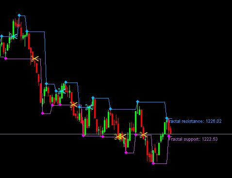

# 📈 MT5 Indicator and Expert Advisor Suite

# EA & Indicator Source Code Collection (Free)

## English:
This repository provides a collection of various Expert Advisors (EAs) and Indicator source codes absolutely free of cost. All shared codes here are open-source and can be downloaded and used without any restrictions. This platform is open to both traders and developers who want to use or modify custom EAs and indicators for Forex or other market analysis.  
You are also welcome to contribute your own codes so that everyone can benefit.

> **Features:**
> - 100% Free Access
> - Open Source Codes
> - Regular Updates
> - Community support for traders and developers

## বাংলা:
এই রিপোজিটরিটিতে আপনি পাবেন বিভিন্ন ধরনের এক্সপার্ট এডভাইজার (EA) এবং ইন্ডিকেটরের সোর্স কোড সম্পূর্ণ ফ্রি-তে। এখানে শেয়ারকৃত সমস্ত কোড আপনি বিনামূল্যে ডাউনলোড ও ব্যবহার করতে পারবেন। এই প্ল্যাটফর্মটি ট্রেডার এবং ডেভেলপারদের জন্য উন্মুক্ত, যারা ফরেক্স বা অন্যান্য মার্কেট বিশ্লেষণে কাস্টম EA বা ইন্ডিকেটর ব্যবহার করতে চান।  
আপনারা চাইলে নিজেদের তৈরি কোডও কন্ট্রিবিউট করতে পারেন, যাতে সবাই উপকৃত হতে পারেন।

> **বৈশিষ্ট্যসমূহ:**
> - ১০০% ফ্রি এক্সেস
> - ওপেন সোর্স কোড
> - নিয়মিত আপডেট
> - ট্রেডার ও ডেভেলপারদের জন্য কমিউনিটি সাপোর্ট

---

**Enjoy trading and happy coding!**

This repository contains a custom-built **MetaTrader 5 (MT5)** indicator and Expert Advisor (EA) designed to enhance precision trading using advanced logic like RSI filters, Smart Money Concepts (SMC), Fair Value Gaps (FVG), Order Blocks (OB), and volume confirmation.

---

## ⚙️ Features

### 🔹 Indicator:
- RSI-based filtering (multi-timeframe)
- Bullish/Bearish Order Block detection
- Fair Value Gap (FVG) visualization
- Volume spike confirmation
- Smart Liquidity Grab logic
- Signal strength scoring
- Real-time alerts and chart labels

### 🔹 Expert Advisor (EA):
- Auto-trading based on indicator signals
- Risk management settings (lot size, SL/TP)
- Signal delay filters
- HTF trend confirmation
- Works on low-latency M1 scalping (Binary/Forex)

---

## 🛠 Installation

1. Open **MetaTrader 5**.
2. Go to `File → Open Data Folder`.
3. Navigate to:  
   `MQL5/Indicators/` → Copy the `.mq5` indicator files  
   `MQL5/Experts/` → Copy the `.mq5` EA files
4. Open **MetaEditor**, compile the files.
5. Restart MT5 or refresh the Navigator panel.

---

## ✅ Recommended Settings

| Setting             | Value                  |
|---------------------|------------------------|
| Timeframe           | M1 (main), M5/M15 (HTF)|
| Pair                | EURUSD, GBPUSD         |
| RSI Period          | 7                      |
| Signal Check Delay  | 5 seconds before candle close |
| Volume Filter       | Enabled                |

---

## 📸 Screenshots

 

---

## 📢 Alerts

- Real-time pop-up + sound alerts
- Optional mobile push notifications
- Alert only when all confluence conditions are met

---

## 👨‍💻 Author

- Developed by: Saddam Forex Trader  
- Contact: saddamfxtrader@gmail.com  
- Whatsapp : +8801818206268 

---

## 📄 License

This project is licensed under the **MIT License**. You are free to use, modify, and distribute the files with proper attribution.

---

## 🙌 Contributions

Pull requests and suggestions are welcome! If you find bugs or want to improve performance, feel free to submit an issue.

